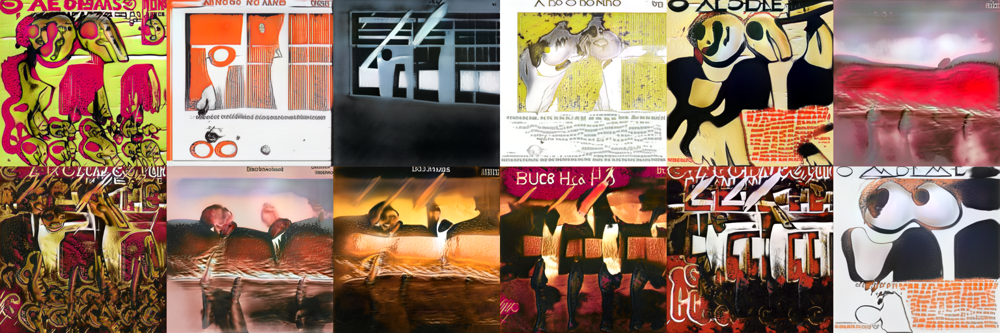
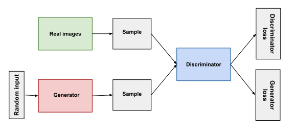

# This Album Cover Does Not Exist
Generating "realistic" album covers with artificial intelligence.

The website: https://tanguyesteoule.github.io/thisalbumdoesnotexist/

## About this project
The idea of this project came to me while watching [this video (FR)](https://www.youtube.com/watch?v=q8iu6UGQnAk) of Defend Intelligence having fun generating the future Miss France.
GANs have already been used to generate [people](https://thispersondoesnotexist.com/), [cats](https://thiscatdoesnotexist.com/), [shoes](https://thissneakerdoesnotexist.com/), [questions from Stack Overflow](https://stackroboflow.com/)... Why not album covers?

Actually, by searching on google, I was able to find [this project](https://veravandeseyp.com/gan-album-art/) (Whose covers are much more realistic than mine) but it was interesting to understand things by myself!

If you take a closer look at the generated covers, you can see very abstract drawings, worthy of a Pink Floyd album.
It is interesting to note the presence of text (which means nothing) in specific places that are often found in the albums.
In short, the result is not really realistic, but it can make nice and cheap album covers.

For fun, I also developed a [Twitter bot](https://twitter.com/album_cover_bot) that posts every day a generated cover.

## About GANs
In this part I have summarized [the course](https://developers.google.com/machine-learning/gan) provided by Google on GANs.

**Generative adversarial networks (GANs)** are generative models: they create new data instances that resemble your training data.
For example, GANs can create images that look like photographs of human faces, even though the faces don't belong to any real person.
This is the case of the famous website [This Person Does Not Exist](https://thispersondoesnotexist.com/), which was used among other things to create fake accounts on Twitter.

GANs achieve this level of realism by pairing a **generator**, which learns to produce the target output, with a **discriminator**, which learns to distinguish true data from the output of the generator.
The generator tries to fool the discriminator, and the discriminator tries to keep from being fooled (explaining the *adversarial* network).

Here's a picture of the whole system:

Both the **generator** and the **discriminator** are neural networks. The generator output is connected directly to the discriminator input. Through backpropagation, the discriminator's classification provides a signal that the generator uses to update its weights.

The **discriminator** in a GAN is simply a classifier. It tries to distinguish real data from the data created by the generator.
During discriminator training, the discriminator ignores the generator loss and just uses the discriminator loss

The **generator** part of a GAN learns to create fake data by incorporating feedback from the discriminator.
It learns to make the discriminator classify its output as real.
The generator takes random noise as its input and then transforms it into a meaningful output. By introducing noise, we can get the GAN to produce a wide variety of data, sampling from different places in the target distribution.

At each iteration the discriminator and the generator are trained one after the other. 
Because a GAN contains two separately trained networks, it is difficult to identify the convergence of the model.
The discriminator feedback gets less meaningful over time. If the GAN continues training past the point when the discriminator is giving completely random feedback, then the generator starts to train on junk feedback, and its own quality may collapse.

For a GAN, convergence is often a fleeting, rather than stable, state.

## How can I do the same?
### Resources
- [Kaggle dataset](https://www.kaggle.com/greg115/album-covers-images) by greg (80k of 512x512 album covers images)
- [StyleGAN2-ADA Model](https://github.com/NVlabs/stylegan2-ada-pytorch/) by Nvidia
- [Google Colab](https://colab.research.google.com/) (To train the model on a GPU)
### Tutorial

For the input data I found on Kaggle a dataset of 80k album covers already preprocessed.
In practice you have to check that the images are homogeneous (same size, same number of channels) .

In this git repository, you can find [an example of a jupyter notebook](https://github.com/tanguyesteoule/thisalbumdoesnotexist/blob/main/notebook/GAN_cover_google_colab.ipynb).
It ran Google Colab so my files are directly in my Google Drive. The big advantage is to be able to run the script remotely and to have access to a GPU. You have to know that the free offer of Colab is enough to train this model but it's not very practical because you always have to stay on the notebook (disconnections are frequent).

As you can see the script is extremely simple. In fact you just have to call the python scripts _dataset_tool_, _train_ and _generate_ with the right parameters.

Note that it is possible to do transfer learning with already trained models (for example for faces), this can be a considerable time saver.
Personally, I use this feature when my notebook is disconnected to restart the training.

To give an idea about the computation time, I trained this network for about 7 days on 1 Tesla P100-PCIE-16GB GPU.

It is interesting to see the evolution of the images according to the training process.
The model learns progressively to draw letters and (kind of) faces:

## Outlooks
- I would like to re-train the current model by filtering by musical genre (To try to understand what differentiates for example metal and classical music covers). 

## Any questions?
Do not hesitate to contact me for any feedback / questions about this project, I will be happy to answer them!

My mail: thisalbumdoesnotexist@protonmail.com